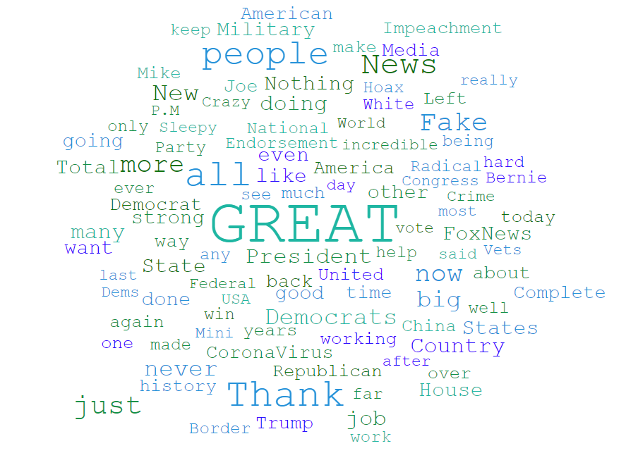
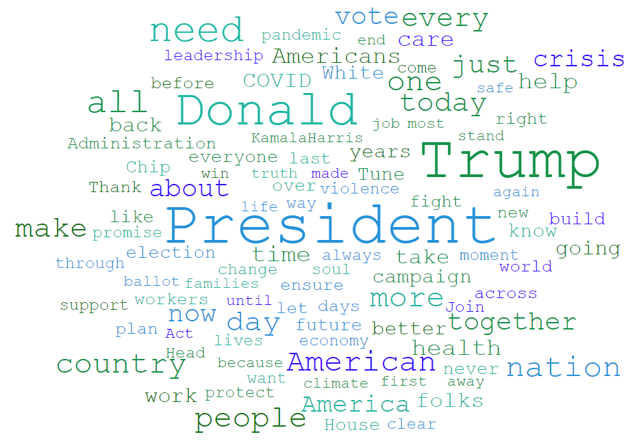

# TwitterDebate

TwitterDebate is a tweet generator for two American president: Donald Trump and Joe Biden. The former president Trump has impressing style of tweeting and is recently blamed for the violence in the White House. These two presidents will have a debate on the context you choose for them in their own style of tweets.

## Implementation

The project is based on [bert4keras](https://github.com/bojone/bert4keras) and the dataset comes from Kaggle: the tweets of [Donald Trump](https://www.kaggle.com/austinreese/trump-tweets) and [Joe Biden](https://www.kaggle.com/rohanrao/joe-biden-tweets).



And the model used is BERT-Tiny to reduce training time and of course we only use a tiny fraction of the dataset also due to limited resources. 

## How to run

To review the example given in the report, run `python run.py` and change the `context` variable to experiment on the model performance on different contexts. 

Examples:

```
context: Sleepy Joe

Trump: You!
Biden: They wake up and tell you to say , folks were keeping these in what they are doing on.

Trump: Thank you to keep up.
Biden: And where they are doing work workers.

Trump: Businesses are they family, jobs.
Biden: And where they are all in the few workers who have a long over those with folks across what we're doing on.

Trump: They are doing.
Biden: But jack her h 9 md to the few folks who are with some of those in workers're doing so many hardest we all more years.

Trump: We are our great country and they finally to keep people that greatest farmers?
Biden: Two kings who are among the last of our nation ?

Trump: We are finally.
Biden: So much hardest than who are all of the people we re not have to any more our greatest heroes that truly corrupt utterly defeated nation?

Trump: They are finally our military.
Biden: Not the generals of our military and decisive heroes who defeated us fighters faced this country.

Trump: Our military bases have no 25 those on all americans .
Biden: The military and our generals who defeated decisive action that corrupt heroes: incapable of doing this crisis.

Trump: Our military deployment s that are finally deployed to achieve freedom .
Biden: All military generals and decisive action defeated the us 3 allies that our nation ?

Trump: Our military and bases have most important countries , we are finally had that these successes .
Biden: All of decisive action that we defeated the military and generals : our allies , not heroic allied heroes are among incredible protective equipment who save this crisis risking their own threats battlefield combat fighters fighting so exceptional front lines forces for deter iranian essential shields .
```

Based on the context, the performance may vary for the reason that we only use tweets from Jan 2020 to June 2020 and there are 2k tweets for each.

## Future Work

1. Train the model into case-sensitive to copycat the UNIQUE style of Trump.
2. Further clean the dataset and remove unnecessary information.
3. Consider other generative methods.